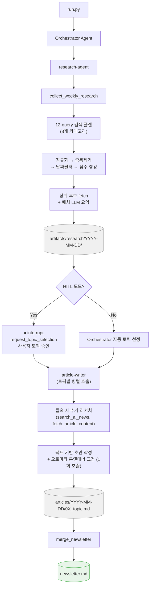

# 오토마타 뉴스레터 자동화
<div align="center">
  
</div>


**오토마타**는 매주 수요일 발행되는 AI/LLM 소식 뉴스레터입니다. 이 프로젝트는 그 뉴스레터 제작 전 과정을 자동화하는 멀티에이전트 시스템입니다.


LangGraph deepagents로 구현된 Orchestrator가 research-agent → article-writer 2개 서브에이전트를 조율해 최신 AI 뉴스 수집부터 토픽 선정, 한국어 기사 작성·문체 교정까지 자동으로 처리합니다. 매주 수요일 사람이 직접 개입 없이 뉴스레터가 완성됩니다.

> 뉴스레터 1편 작성에 걸리던 시간을 **1주일 → 30분~1시간**으로 단축. 현재 실제 발행 중인 시스템입니다.

## 시스템 아키텍처



## 핵심 기술 하이라이트

1. **멀티에이전트 오케스트레이션** — Orchestrator가 research-agent(수집) → article-writer(토픽별 리서치 보강+작성+톤 교정 통합)를 조율. deepagents의 dict 기반 에이전트 정의로 역할별 교체·독립 테스트 가능한 구조

2. **결정론적 리서치 파이프라인** — 오픈엔드 LLM 검색 루프 대신 8개 카테고리, 12-query 고정 플랜 → 정규화 → 중복제거 → 날짜필터 → 점수 랭킹 → 선택적 fetch → 배치 LLM 요약의 7단계 파이프라인으로 재현 가능한 결과 보장

3. **Human-in-the-Loop** — LangGraph `interrupt_on` 메커니즘으로 토픽 후보 제시 후 사용자 승인·수정·거부를 받아 `Command(resume=...)` 패턴으로 재개. 완전 자동화와 수동 작업 사이의 균형점

4. **비용 제어** — 리서치 결과 캐싱(존재 시 재사용), 배치 LLM 요약(N번 API 콜 → 1번), `max_fetches` 캡으로 API 비용 예측 가능하게 유지

5. **실행 텔레메트리** — 스트림 이벤트 수, 토큰 사용량, 도구 호출 횟수, 실행 시간을 `run_metrics.json`으로 아티클 디렉토리에 함께 저장해 실행별 비용 추적 가능

6. **LangSmith 모니터링** — 에이전트 실행 트레이스를 LangSmith로 추적. 서브에이전트 간 메시지 흐름, 도구 호출 결과, 각 스텝별 LLM 입출력을 시각화해 프롬프트 디버깅 및 에이전트 행동 분석에 활용

## 설계 결정

| 결정 | 이유 |
|------|------|
| **deepagents (LangGraph raw 대신)** | `StateGraph` 노드/엣지 보일러플레이트 제거 → dict 기반 에이전트 정의로 로직 집중. 내장 Todo-list로 멀티스텝 작업 추적 및 오류 시 자동 업데이트. `FilesystemBackend`로 로컬 파일 직접 읽기/편집 가능 |
| **결정론적 파이프라인** | 오픈엔드 LLM 검색 루프는 실행마다 결과가 달라 재현 불가, API 비용 예측 불가 → 8개 카테고리, 12-query 고정 플랜 + 점수 기반 랭킹으로 대체해 결정론적 결과 보장 |
| **HITL** | 완전 자동화 운영 시 토픽 품질 저하 경험 → LangGraph interrupt로 토픽 선정 단계에서만 사람이 개입하는 승인 단계 삽입 |
| **리서치 결과 캐싱** | 리서치가 전체 파이프라인에서 가장 비싼 단계(시간·비용) → 결과 파일 존재 시 재사용해 재실행 비용 절감 |
| **배치 LLM 요약** | 후보 기사별 개별 요약 시 API 호출 N배 발생 → 전체 후보를 단일 배치 콜로 통합해 비용 절감 |
| **article-writer 통합** | 기존 writer/tone-editor 2단계 호출을 article-writer 1개로 병합 → 토픽별 리서치 보강, 팩트 기반 작성, 톤앤매너 교정을 단일 호출로 처리해 API 호출 수·레이턴시 절감 |

## 에이전트 구성

| 에이전트 | 역할 | 도구 |
|----------|------|------|
| **Orchestrator** | 전체 워크플로우 조율, 토픽 선정(HITL 시 `request_topic_selection`으로 사용자 승인), 파일 저장, 뉴스레터 병합 | `save_article`, `merge_newsletter`, `request_topic_selection`(HITL) |
| **research-agent** | AI/LLM 뉴스 수집 파이프라인 실행, 후보 정제 및 요약 | `collect_weekly_research`, `fetch_article_content` |
| **article-writer** | 토픽별 필요 시 추가 리서치 → 팩트 기반 초안 작성 → 오토마타 톤앤매너(해요체, 기술 용어 한/영 병기) 교정을 1회 호출로 처리 | `search_ai_news`, `fetch_article_content` |

## 실행 방법

### 환경 설정

```bash
cp .env.example .env
# .env에서 설정:
# ANTHROPIC_API_KEY=...
# TAVILY_API_KEY=...
# LANGSMITH_TRACING=true   # 선택사항 — LangSmith 모니터링
# LANGCHAIN_API_KEY=...    # 선택사항
```

### 설치

```bash
uv sync
```

### 실행

```bash
# 다음 수요일 발행용 뉴스레터 생성
uv run python run.py

# 특정 날짜 지정
uv run python run.py --date 2026-01-22

# Human-in-the-Loop 모드 (토픽 직접 선택)
uv run python run.py --hitl

# 빠른 테스트 (아티클 1개만)
uv run python run.py --quick

# 기존 아티클 병합만 수행
uv run python run.py --merge 2026-01-15
```

## 기술 스택

| 구분 | 기술 |
|------|------|
| 에이전트 프레임워크 | deepagents (LangGraph wrapper) |
| LLM | Claude Sonnet 4.6 (Anthropic) |
| 검색 | Tavily API, HackerNews Algolia API |
| 모니터링 | LangSmith (에이전트 트레이스, 디버깅) |
| 런타임 | Python 3.11+, uv |
| 체크포인트 | LangGraph MemorySaver (HITL 모드) |
| 파일 접근 | deepagents FilesystemBackend |
