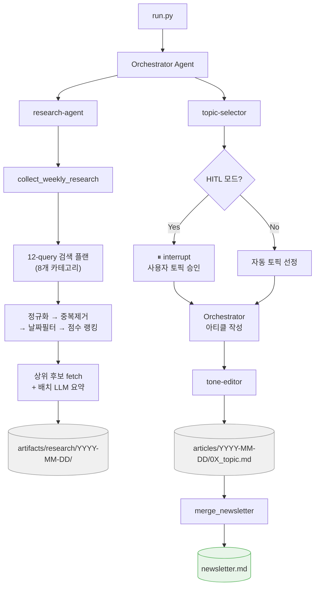

# README 포트폴리오 리디자인 구현 플랜

> **For agentic workers:** REQUIRED SUB-SKILL: Use superpowers:subagent-driven-development (recommended) or superpowers:executing-plans to implement this plan task-by-task. Steps use checkbox (`- [ ]`) syntax for tracking.

**Goal:** `README.md` 단일 파일을 AI/ML 엔지니어 포지션 포트폴리오용으로 전면 재작성

**Architecture:** README.md 하나만 수정. 코드 변경 없음. Mermaid 다이어그램 인라인 삽입. 섹션 순서: 헤더+뱃지 → 소개+임팩트 → 아키텍처 → 하이라이트 → 설계결정 → 에이전트구성 → 실행방법 → 기술스택.

**Tech Stack:** Markdown, shields.io badges, Mermaid (GitHub 네이티브 렌더링)

## Global Constraints

- 언어: 한국어 전용
- 파일 수정 범위: `README.md` 1개만
- 코드 변경 없음
- Mermaid 다이어그램: 이미지 파일 생성 없이 인라인 코드블록으로
- 뱃지: shields.io 정적 뱃지 사용 (외부 API 의존 없음)

---

### Task 1: 헤더 + 뱃지 + 소개 섹션 작성

**Files:**
- Modify: `README.md` (전체 교체)

**Interfaces:**
- Produces: README.md 상단 — 헤더, 뱃지 6개, 한 줄 소개, 임팩트 수치

- [ ] **Step 1: README.md 상단 작성**

`README.md`를 아래 내용으로 교체 (기존 내용 전체 삭제 후 시작):

```markdown
# 오토마타 뉴스레터 자동화


LangGraph deepagents 기반 멀티에이전트 시스템으로 매주 수요일 AI/LLM 뉴스레터를 자동 생성·발행하는 프로젝트입니다.

> 뉴스레터 1편 작성에 걸리던 시간을 **1주일 → 30분~1시간**으로 단축. 현재 실제 발행 중인 시스템입니다.
```

- [ ] **Step 2: 시각 확인**

`README.md` 파일을 GitHub 또는 로컬 Markdown 뷰어로 열어 확인:
- 뱃지 6개 렌더링 확인
- 인용구(`>`) 블록 렌더링 확인

- [ ] **Step 3: 커밋**

```bash
git add README.md
git commit -m "docs(readme): add header, badges, and impact summary"
```

---

### Task 2: Mermaid 아키텍처 다이어그램 추가

**Files:**
- Modify: `README.md` (Task 1 이어서)

**Interfaces:**
- Consumes: Task 1의 README.md 상단
- Produces: `## 시스템 아키텍처` 섹션 — Mermaid 플로우 다이어그램

- [ ] **Step 1: 아키텍처 섹션 추가**

Task 1 내용 아래에 이어서 작성:

````markdown

## 시스템 아키텍처


````

- [ ] **Step 2: 시각 확인**

GitHub에서 Mermaid 다이어그램이 렌더링되는지 확인. 로컬에서는 VS Code Markdown Preview Enhanced 확장 또는 [mermaid.live](https://mermaid.live)에 붙여넣어 확인 가능.

노드 연결 순서: `run.py → Orchestrator → research-agent → (파이프라인) → topic-selector → (HITL 분기) → 아티클 작성 → tone-editor → 파일 저장 → merge → newsletter.md`

- [ ] **Step 3: 커밋**

```bash
git add README.md
git commit -m "docs(readme): add mermaid architecture diagram"
```

---

### Task 3: 핵심 기술 하이라이트 + 설계 결정 섹션 추가

**Files:**
- Modify: `README.md` (Task 2 이어서)

**Interfaces:**
- Consumes: Task 2의 README.md
- Produces: `## 핵심 기술 하이라이트` 섹션 (6개 bullet) + `## 설계 결정` 섹션 (테이블)

- [ ] **Step 1: 핵심 기술 하이라이트 섹션 추가**

Task 2 내용 아래에 이어서 작성:

```markdown

## 핵심 기술 하이라이트

1. **멀티에이전트 오케스트레이션** — Orchestrator가 research / topic-selector / tone-editor 3개 서브에이전트를 순차 조율. deepagents의 dict 기반 에이전트 정의로 역할별 교체·독립 테스트 가능한 구조

2. **결정론적 리서치 파이프라인** — 오픈엔드 LLM 검색 루프 대신 8개 카테고리 × 12개 쿼리 고정 플랜 → 정규화 → 중복제거 → 날짜필터 → 점수 랭킹 → 선택적 fetch → 배치 LLM 요약의 7단계 파이프라인으로 재현 가능한 결과 보장

3. **Human-in-the-Loop** — LangGraph `interrupt_on` 메커니즘으로 토픽 후보 제시 후 사용자 승인·수정·거부를 받아 `Command(resume=...)` 패턴으로 재개. 완전 자동화와 수동 작업 사이의 균형점

4. **비용 제어** — 리서치 결과 캐싱(존재 시 재사용), 배치 LLM 요약(N번 API 콜 → 1번), `max_fetches` 캡으로 API 비용 예측 가능하게 유지

5. **실행 텔레메트리** — 스트림 이벤트 수, 토큰 사용량, 도구 호출 횟수, 실행 시간을 `run_metrics.json`으로 아티클 디렉토리에 함께 저장해 실행별 비용 추적 가능

6. **LangSmith 모니터링** — 에이전트 실행 트레이스를 LangSmith로 추적. 서브에이전트 간 메시지 흐름, 도구 호출 결과, 각 스텝별 LLM 입출력을 시각화해 프롬프트 디버깅 및 에이전트 행동 분석에 활용
```

- [ ] **Step 2: 설계 결정 섹션 추가**

핵심 기술 하이라이트 아래에 이어서 작성:

```markdown

## 설계 결정

| 결정 | 이유 |
|------|------|
| **deepagents (LangGraph raw 대신)** | `StateGraph` 노드/엣지 보일러플레이트 제거 → dict 기반 에이전트 정의로 로직 집중. 내장 Todo-list로 멀티스텝 작업 추적 및 오류 시 자동 업데이트. `FilesystemBackend`로 로컬 파일 직접 읽기/편집 가능 |
| **결정론적 파이프라인** | 오픈엔드 LLM 검색 루프는 실행마다 결과가 달라 재현 불가, API 비용 예측 불가 → 12-query 고정 플랜 + 점수 기반 랭킹으로 대체해 결정론적 결과 보장 |
| **HITL** | 완전 자동화 운영 시 토픽 품질 저하 경험 → LangGraph interrupt로 토픽 선정 단계에서만 사람이 개입하는 승인 단계 삽입 |
| **연구 결과 캐싱** | 리서치가 전체 파이프라인에서 가장 비싼 단계(시간·비용) → 결과 파일 존재 시 재사용해 재실행 비용 절감 |
| **배치 LLM 요약** | 후보 기사별 개별 요약 시 API 호출 N배 발생 → 전체 후보를 단일 배치 콜로 통합해 비용 절감 |
| **서브에이전트 분리** | research / topic-selector / tone-editor 역할을 독립 에이전트로 분리 → 각각 시스템 프롬프트·도구·교체 독립적으로 가능 |
```

- [ ] **Step 3: 시각 확인**

테이블 렌더링 확인. 특히 `|` 이스케이프 없이 셀 안 텍스트가 깨지지 않는지 확인.

- [ ] **Step 4: 커밋**

```bash
git add README.md
git commit -m "docs(readme): add technical highlights and engineering decisions"
```

---

### Task 4: 에이전트 구성 + 실행 방법 + 기술 스택 추가

**Files:**
- Modify: `README.md` (Task 3 이어서)

**Interfaces:**
- Consumes: Task 3의 README.md
- Produces: `## 에이전트 구성` + `## 실행 방법` + `## 기술 스택` 섹션 — README.md 완성

- [ ] **Step 1: 에이전트 구성 섹션 추가**

Task 3 내용 아래에 이어서 작성:

```markdown

## 에이전트 구성

| 에이전트 | 역할 | 도구 |
|----------|------|------|
| **Orchestrator** | 전체 워크플로우 조율, 아티클 작성 지시, 파일 저장, 뉴스레터 병합 | `save_article`, `merge_newsletter` |
| **research-agent** | AI/LLM 뉴스 수집 파이프라인 실행, 후보 정제 및 요약 | `collect_weekly_research`, `fetch_article_content` |
| **topic-selector** | 3개 메인 토픽 + 1개 스터디카페 토픽 선정 (HITL 지원) | 추론 전용 (도구 없음) |
| **tone-editor** | 오토마타 스타일(해요체, 기술 용어 한/영 병기) 교정 | 추론 전용 (도구 없음) |
```

- [ ] **Step 2: 실행 방법 섹션 추가**

에이전트 구성 아래에 이어서 작성:

```markdown

## 실행 방법

### 환경 설정

```bash
cp .env.example .env
# .env에서 설정:
# ANTHROPIC_API_KEY=...
# TAVILY_API_KEY=...
# LANGSMITH_TRACING=true   # 선택사항 — LangSmith 모니터링
# LANGCHAIN_API_KEY=...    # 선택사항
```

### 설치

```bash
uv sync
```

### 실행

```bash
# 다음 수요일 발행용 뉴스레터 생성
uv run python run.py

# 특정 날짜 지정
uv run python run.py --date 2026-01-22

# Human-in-the-Loop 모드 (토픽 직접 선택)
uv run python run.py --hitl

# 빠른 테스트 (아티클 1개만)
uv run python run.py --quick

# 기존 아티클 병합만 수행
uv run python run.py --merge 2026-01-15
```
```

- [ ] **Step 3: 기술 스택 섹션 추가**

실행 방법 아래에 이어서 작성:

```markdown

## 기술 스택

| 구분 | 기술 |
|------|------|
| 에이전트 프레임워크 | [deepagents](https://github.com/deepagents/deepagents) (LangGraph wrapper) |
| LLM | Claude Sonnet 4.6 (Anthropic) |
| 검색 | Tavily API, HackerNews Algolia API |
| 모니터링 | LangSmith (에이전트 트레이스, 디버깅) |
| 런타임 | Python 3.11+, uv |
| 체크포인트 | LangGraph MemorySaver (HITL 모드) |
| 파일 접근 | deepagents FilesystemBackend |
```

- [ ] **Step 4: 전체 README 최종 시각 확인**

전체 README를 GitHub 또는 Markdown 뷰어에서 확인:
- 모든 뱃지 정상 표시
- Mermaid 다이어그램 렌더링
- 모든 테이블 열 정렬 정상
- 코드블록 언어 하이라이팅 정상
- 섹션 순서: 헤더 → 소개 → 아키텍처 → 하이라이트 → 설계결정 → 에이전트 → 실행 → 스택

- [ ] **Step 5: 최종 커밋**

```bash
git add README.md
git commit -m "docs(readme): complete portfolio redesign with agent structure and tech stack"
```

---

## Self-Review

**스펙 커버리지 확인:**

| 스펙 요구사항 | 구현 태스크 |
|--------------|------------|
| 헤더 + 뱃지 (Python, LangGraph, Claude, Tavily, LangSmith, Status) | Task 1 |
| 한 줄 소개 + 실제 발행 중 명시 | Task 1 |
| 임팩트 수치 (1주일 → 30분~1시간) | Task 1 |
| Mermaid 아키텍처 다이어그램 | Task 2 |
| 핵심 기술 하이라이트 6개 | Task 3 Step 1 |
| 설계 결정 테이블 (deepagents 이유 포함) | Task 3 Step 2 |
| 에이전트 구성 테이블 | Task 4 Step 1 |
| 실행 방법 | Task 4 Step 2 |
| 기술 스택 테이블 | Task 4 Step 3 |

갭 없음.

**Placeholder 스캔:** 없음. 모든 섹션에 실제 내용 포함.

**일관성:** deepagents 링크를 Task 4 기술스택에 포함했으나 실제 GitHub URL이 불분명한 경우 링크 제거하고 텍스트만 유지할 것.
