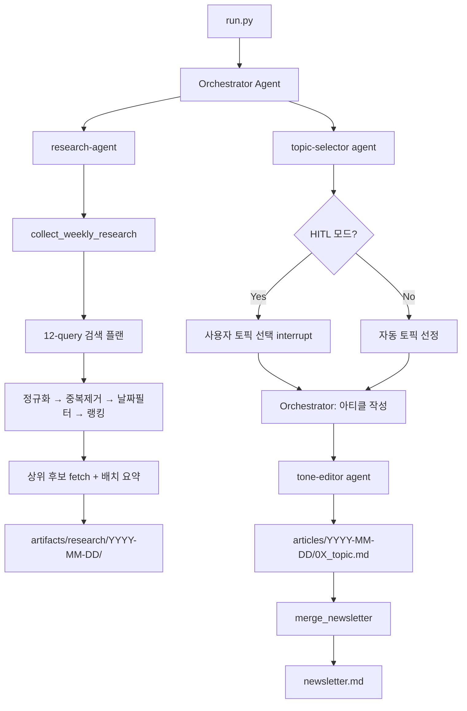

# README 포트폴리오 리디자인 스펙

**날짜:** 2026-06-30  
**대상:** AI/ML 엔지니어 포지션 지원용 포트폴리오  
**언어:** 한국어  
**범위:** `README.md` 전체 재작성 (코드 변경 없음)

---

## 목표

현재 README는 설치/실행 방법만 담긴 개발자 메모 수준.  
채용담당자(AI/ML 엔지니어 포지션)가 GitHub를 열었을 때 30초 안에 다음 두 질문에 답해야 한다:

1. 이게 실제로 돌아가는 시스템인가?
2. 어떤 어려운 엔지니어링 문제를 풀었는가?

---

## 섹션 구조

### 1. 헤더 + 뱃지

```
# 오토마타 뉴스레터 자동화
```

뱃지 (shields.io):
- Python 3.11+
- LangGraph
- Claude claude-sonnet-4-6
- Tavily
- LangSmith
- 상태: Live

### 2. 한 줄 소개 + 실제 발행 중임 명시

"LangGraph deepagents 기반 멀티에이전트 시스템으로 매주 수요일 AI/LLM 뉴스레터를 자동 생성·발행하는 프로젝트입니다."

- 실제 발행 중임을 첫 문단에서 명시 (e.g. "현재 실제 발행 중인 뉴스레터")
- **임팩트 수치 명시:** 뉴스레터 1편 작성에 걸리던 시간을 1주일 → 30분~1시간으로 단축
- 뉴스레터 링크가 있다면 포함

### 3. 시스템 아키텍처

Mermaid 플로우 다이어그램:



### 4. 핵심 기술 하이라이트

5개 bullet:

1. **멀티에이전트 오케스트레이션** — Orchestrator가 research / topic-selector / tone-editor 3개 서브에이전트를 순차 조율. deepagents의 dict 기반 에이전트 정의로 역할별 교체·테스트 가능한 구조
2. **결정론적 리서치 파이프라인** — 오픈엔드 LLM 검색 루프 대신 8개 카테고리 × 12개 쿼리 고정 플랜 → 정규화 → 중복제거 → 날짜필터 → 점수 랭킹 → 선택적 fetch → 배치 LLM 요약 7단계 파이프라인
3. **Human-in-the-Loop** — LangGraph `interrupt_on` 메커니즘으로 토픽 후보 제시 후 사용자 승인·수정 후 계속 실행. `Command(resume=...)` 패턴으로 재개
4. **비용 제어** — 리서치 결과 캐싱(존재 시 재사용), 배치 LLM 요약(N번 API 콜 → 1번), max_fetches 캡으로 API 비용 예측 가능
5. **실행 텔레메트리** — 스트림 이벤트 수, 토큰 사용량, 도구 호출 횟수, 실행 시간을 `run_metrics.json`으로 아티클 디렉토리에 함께 저장
6. **LangSmith 모니터링** — 에이전트 실행 트레이스를 LangSmith로 추적. 서브에이전트 간 메시지 흐름, 도구 호출 결과, 각 스텝별 LLM 입출력을 시각적으로 확인해 프롬프트 디버깅 및 에이전트 행동 분석에 활용

### 5. 설계 결정 (Engineering Decisions)

테이블 형식:

| 결정 | 이유 |
|------|------|
| **deepagents (LangGraph raw 대신)** | `StateGraph` 노드/엣지 보일러플레이트 제거 → dict 기반 에이전트 정의로 로직 집중. 내장 Todo-list로 리서치+기사 작성 멀티스텝 추적 및 오류 시 자동 업데이트. `FilesystemBackend`로 로컬 파일 직접 읽기/편집 |
| **결정론적 파이프라인** | 오픈엔드 LLM 검색 루프는 재현 불가·비용 예측 불가 → 12-query 고정 플랜 + 점수 기반 랭킹으로 대체 |
| **HITL** | 완전 자동화 시 토픽 품질 저하 경험 → LangGraph interrupt로 사람이 개입하는 승인 단계 삽입 |
| **연구 결과 캐싱** | 리서치가 가장 비싼 단계 → 결과 존재 시 재사용으로 반복 실행 비용 절감 |
| **배치 LLM 요약** | 후보별 개별 요약 시 API 호출 N배 → 단일 배치 콜로 통합 |
| **서브에이전트 분리** | research / topic-selector / tone-editor 역할 독립 분리 → 각각 교체·테스트 가능 |

### 6. 에이전트 구성

각 에이전트 1-2줄 설명:

| 에이전트 | 역할 | 도구 |
|----------|------|------|
| Orchestrator | 전체 워크플로우 조율, 아티클 저장, 뉴스레터 병합 | `save_article`, `merge_newsletter` |
| research-agent | AI/LLM 뉴스 수집 파이프라인 실행 | `collect_weekly_research`, `fetch_article_content` |
| topic-selector | 3개 메인 + 1개 스터디카페 토픽 선정 | (추론 전용, 도구 없음) |
| tone-editor | 오토마타 스타일(해요체) 교정 | (추론 전용, 도구 없음) |

### 7. 실행 방법

현재 README 내용 유지 (간략히). 환경 변수 설정 → `uv run python run.py`.

### 8. 기술 스택 테이블

| 구분 | 기술 |
|------|------|
| 에이전트 프레임워크 | deepagents (LangGraph wrapper) |
| LLM | Claude claude-sonnet-4-6 (Anthropic) |
| 검색 | Tavily API, HackerNews Algolia API |
| 런타임 | Python 3.11+, uv |
| 체크포인트 | LangGraph MemorySaver (HITL 모드) |
| 아티팩트 | 로컬 파일시스템 (FilesystemBackend) |
| 모니터링 | LangSmith (에이전트 트레이스, 디버깅) |

---

## 범위 밖

- 코드 변경 없음
- 새 파일 생성 없음 (README.md만 수정)
- 다이어그램 이미지 파일 생성 없음 (Mermaid 인라인 사용)
- 영문 번역 없음

---

## 성공 기준

- GitHub에서 30초 스캔 시 "실제 동작 중인 멀티에이전트 시스템"임을 즉시 파악 가능
- 설계 결정 섹션에서 엔지니어링 판단력 확인 가능
- Mermaid 다이어그램으로 에이전트 플로우 시각적 파악 가능
